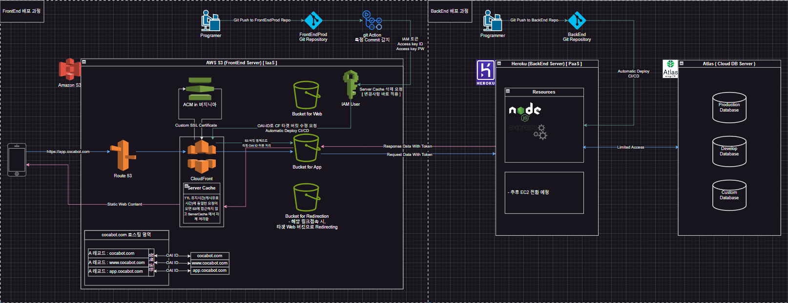

## 구성


#### 
# FrontEnd 구성 overview
#### 
- vite 모듈번들러 - react - tailWind CSS
- 컴포넌트 기반 아키텍처
- mongoose (mongoDB), (cloud Server DB : Atlas)
  - [MongoDB Atlas](https://cloud.mongodb.com/v2#/org/66fcba7d069a4d43c73cf7af/projects)
- 구글 MAP_API 사용
  - [Google Cloud Console](https://console.cloud.google.com/apis/credentials?hl=ko&project=effective-brook-437306-h0)
- FrontEnd 서버
  - ***AWS s3***
    - [awsS3] https://eu-north-1.console.aws.amazon.com/console/home?region=eu-north-1#
- BackEnd 서버
  - ***heroku***
    - [heroku] https://dashboard.heroku.com/

___

#### 
# FrontEnd 구성 설명
#### 

### ( react - vite - tailWind CSS << 컴포넌트 기반 아키텍처 )
###### src/
###### ├── components/         # UI 컴포넌트
###### │   ├── atoms/          # 가장 작은 단위의 컴포넌트 (Button, Input 등)
###### │   ├── molecules/      # Atoms를 조합한 컴포넌트 (SearchBar, UserCard 등)
###### │   ├── organisms/      # Molecules를 조합한 더 큰 컴포넌트 (Header, Footer 등)
###### │   ├── templates/      # 페이지 레이아웃 (DashboardLayout 등)
###### │   └── pages/          # 실제 페이지 (HomePage, ProfilePage 등)
###### ├── context/            # 전역 상태 관리 (React Context API)
###### │   └── UserContext.js
###### ├── hooks/              # 커스텀 훅 (useFetch, useNativeBridge 등)
###### │   ├── useFetch.js
###### │   └── useNativeBridge.js
###### ├── utils/              # 유틸리티 함수 (API 호출, 데이터 포맷팅 등)
###### │   ├── api.js
###### │   └── format.js
###### ├── styles/             # Tailwind CSS 설정 및 글로벌 스타일
###### │   ├── index.css
###### │   └── tailwind.config.js
###### ├── App.jsx             # 앱의 진입점
###### ├── App.jsx             # 
###### ├── App.jsx             # 
###### ├── App.jsx             # 
###### └── main.jsx            # ReactDOM 렌더링

### 환경변수 설명
  - `.env` <- 개발환경, 배포판 공통 환경변수
  - `.env.development` <- 개발환경 환경변수
  - `.env.production`  <- 배포판 환경변수
  - `github에 "Actions secrets and variables"` <- AWS S3 버킷 업로드 코드 ( with hosted backend )

___

#### 
# FrontEnd( JavaScript, React ) 설치 및 배포
#### 

### Library 설치
```bash
$ npm i
```

### AWS S3 업로드
  - `https://eu-north-1.console.aws.amazon.com/s3/home?region=eu-north-1#` 
  - 해당링크에서 APP 전용 도메인 버킷에 업로드
  - FrontEndProd에 `Release_v*.* [***]` 커밋명으로 푸시 ( Git Action -> IAM 자동 업로드 )
  - OR `$ npm run build` 으로 빌드해서 dist 에 있는 파일을 직접 업로드 해도됨

___

#### 
# FrontEnd 실행 방법 
##### 터미널2개 필요
#####  - Tailwind CSS의 JIT(Just-In-Time) 모드
#####  - vite의 HMR(Hot Module Replacement)
#### 

### [tailWind CSS 실시간 적용 ]
***변경사항 감지시 ./src/output.css를 빌드해 실시간으로 Web에 적용***
```bash
npx tailwindcss -i ./src/index.css -o ./src/output.css --watch
```
### FrontEnd code 배포판 빌드
***npm run build 시, .env.production 환경변수를 참조해 빌드***
***npm run build 시, dist package 파일들을 AWS S3 업로드 하면 된다***
```bash
$ npm run build
```
### [vite + React 프로젝트] Local Test ( with hosted backend )
***localhost:3000 으로 서버구성해서 dist 디렉토리에 있는 코드 로컬실행***
```bash
$ npm run build
$ npm run preview -- --port 3000 --host
```
### [vite + React 프로젝트] Local Test ( with local backend )
***npm run dev 시, .env.development 환경변수를 참조해 빌드***
```bash
$ npm run dev -- --port 3000 --host
```


#### 
# 구성
#### 
  - react
  - vite 모듈 번들러
  - tailWind CSS LIB 사용

___

#### 
# vite 프로젝트 생성
#### 

### install
```bash
$ npm create vite@latest viteProject --template react
$ cd viteProject
$ npm install
```

___

#### 
# Tailwind CSS 설치 및 설정
#### 

### install
```bash
$ npm install -D tailwindcss postcss autoprefixer
$ npx tailwindcss init
```
### Setup
***tailwind.config.js 설정*** 
```js 
/** @type {import('tailwindcss').Config} */
module.exports = {
  content: [
    "./src/**/*.{html,js,jsx}" // JSX 파일 추가
  ],
  theme: {
    extend: {},
  },
  plugins: [],
}
```
***src/index.css 설정***
```css
@tailwind base;
@tailwind components;
@tailwind utilities;
 ... 여기부터 기존 코드 ....
```
***output.css 빌드***
 - index.css를 읽어서 Tailwind CSS를 포함한 output.css로 빌드
```bash
$ npx tailwindcss -i ./src/index.css -o ./src/output.css
```
***index.html 설정***
 - Main HTML 문서(index.html)에 Tailwind CSS를 포함한 output.css 스타일 적용
```html
<link href="./src/output.css" rel="stylesheet">
```
```html
전체 코드 예시
<!doctype html>
<html lang="en">
  <head>
    <meta charset="UTF-8" />
    <link rel="icon" type="image/svg+xml" href="/vite.svg" />
    <meta name="viewport" content="width=device-width, initial-scale=1.0" />
    <link href="./src/output.css" rel="stylesheet">
    <title>Vite + React</title>
  </head>
  <body>
    <div id="root"></div>
    <script type="module" src="/src/main.jsx"></script>
  </body>
</html>
```
***tailWind 및 vite 실시간 변경 되는지 확인할만 한 코드***
 - src/App.jsx
```jsx
import { useState } from "react";
import reactLogo from "./assets/react.svg";
import viteLogo from "/vite.svg";
import "./App.css";

function App() {
  const [count, setCount] = useState(0);

  return (
    <form>
      <h1>Hi Vite 모듈번들러, and tailWind CSS</h1>
      <div className="grid gap-6 mb-6 md:grid-cols-2">
        <div className="flex flex-col">
          <p1 className="text-left ">taiWind CSS 확인용</p1>
          <p1 className="text-left text-red-500">taiWind CSS 확인용</p1>
        </div>
      </div>
      <>
        <div>
          <a href="https://vite.dev" target="_blank">
            
          </a>
          <a href="https://react.dev" target="_blank">
            
          </a>
        </div>
        <div className="card">
          <button type="button" onClick={() => setCount((count) => count + 1)}>
            count is {count}
          </button>
        </div>
        <p className="read-the-docs">
          Click on the Vite and React logos to learn more
        </p>
      </>
    </form>
  );
}

export default App;
```

___

#### 
# 사용 방법
#### 

### FrontEnd code 배포판 빌드
***npm run build 시, .env.production 환경변수를 참조해 빌드***
***npm run build 시, dist package 파일들을 AWS S3 업로드 하면 된다***
```bash
$ npm run build
```
### [tailWind CSS 실시간 적용 ]
***변경사항 감지시 ./src/output.css를 빌드해 실시간으로 Web에 적용***
```bash
npx tailwindcss -i ./src/index.css -o ./src/output.css --watch
```
### [vite + React 프로젝트] Local Test ( with hosted backend )
***localhost:3000 으로 서버구성해서 dist 디렉토리에 있는 코드 로컬실행***
```bash
$ npm run build
$ npm run preview -- --port 3000 --host
```
### [vite + React 프로젝트] Local Test ( with local backend )
***npm run dev 시, .env.development 환경변수를 참조해 빌드***
```bash
$ npm run dev -- --port 3000 --host
```


