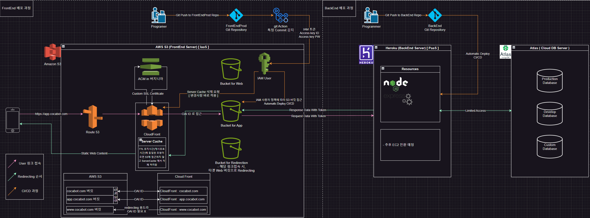
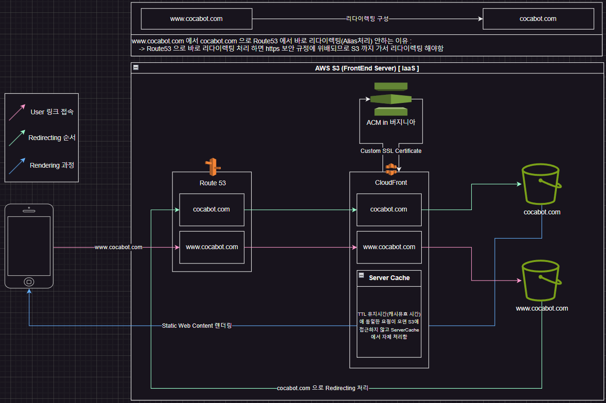

## 구성도


##  리다이렉팅 순서



#### 
# FrontEnd 구성 overview
#### 
- vite 모듈번들러 - react - tailWind CSS
- 컴포넌트 기반 아키텍처
- mongoose (mongoDB), (cloud Server DB : Atlas)
  - [MongoDB Atlas](https://cloud.mongodb.com/v2#/org/66fcba7d069a4d43c73cf7af/projects)
- 구글 MAP_API 사용
  - [Google Cloud Console](https://console.cloud.google.com/apis/credentials?hl=ko&project=effective-brook-437306-h0)
- FrontEnd 서버
  - ***AWS s3***
    - [awsS3] https://eu-north-1.console.aws.amazon.com/console/home?region=eu-north-1#
- BackEnd 서버
  - ***heroku***
    - [heroku] https://dashboard.heroku.com/

___

#### 
# FrontEnd 구성 설명
#### 

### ( react - vite - tailWind CSS << 컴포넌트 기반 아키텍처 )
```tree
src/
├── asset/                        # 이미지 파일들 (svg ..)
|   └──                           
├── components/                   # UI 컴포넌트들을 모아둔 디렉토리 
|   ├── templates/                # 전체 레이아웃 구조 
|   │   └── MainLayout.jsx        # 사이드바, GNB 등을 포함한 전체 레이아웃
|   ├── organisms/                # 큰 구조의 독립적 영역 [ Gnb, SideBar]
|   │   ├── Sidebar.jsx           # 사이드 네비게이션 영역
|   │   └── Gnb.jsx               # 글로벌 네비게이션 바 영역
|   ├── molecules/                # 재사용 가능한 복합 컴포넌트 [ Modal, Card, SearchBar]
|   │   └── 
|   ├── atoms/                    # 가장 기본이 되는 컴포넌트 [ button, Input, spinner]
|   │   ├──
|   │   └── icons/                # 아이콘 모음
|   │       └──
├── pages/                        # 실제 라우팅되는 페이지들
|   ├── AddDevice.jsx             #
|   ├── Debug.jsx                 #
|   ├── Routine.jsx               #
|   ├── Auth.jsx                  #
|   ├── Home.jsx                  #
|   ├── My.jsx                    #
|   └── Settings.jsx              #
├── context/                      # React Context API를 사용한 전역 상태 관리 디렉토리
│   └──       
├── hooks/                        # 재사용 가능한 커스텀 훅들을 모아둔 디렉토리
│   └──     
├── styles/                       # 스타일 관련 파일들을 모아둔 디렉토리
│   └── index.css                 # Tailwind CSS 설정 및 전역 스타일
├── utils/                        # 여러 곳에서 재사용되는 유틸리티 함수들을 모아둔 디렉토리
│   ├──       
│   └──       
├── App.jsx                       # 앱의 최상위 컴포넌트
├── index.css                     # 기본 스타일시트
├── main.jsx                      # React 앱의 진입점 (ReactDOM.render)
└── output.css                    # Tailwind CSS가 빌드된 최종 CSS 파일
```

### 환경변수 설명
  - `.env` <- 개발환경, 배포판 공통 환경변수
  - `.env.development` <- 개발환경 환경변수
  - `.env.production`  <- 배포판 환경변수
  - `github에 "Actions secrets and variables"` <- AWS S3 버킷 업로드 코드 ( with hosted backend )

___

#### 
# FrontEnd( JavaScript, React ) 설치 및 배포
#### 

### Library 설치
```bash
$ npm i
```

### AWS S3 업로드
  - `https://eu-north-1.console.aws.amazon.com/s3/home?region=eu-north-1#` 
  - 해당링크에서 APP 전용 도메인 버킷에 업로드
  - FrontEndProd에 `Release_v*.* [***]` 커밋명으로 푸시 ( Git Action -> IAM 자동 업로드 )
  - OR `$ npm run build` 으로 빌드해서 dist 에 있는 파일을 직접 업로드 해도됨

___

#### 
# FrontEnd 실행 방법 
##### 터미널2개 필요
#####  - Tailwind CSS의 JIT(Just-In-Time) 모드
#####  - vite의 HMR(Hot Module Replacement)
#### 

### [tailWind CSS 실시간 적용 ]
***변경사항 감지시 ./src/output.css를 빌드해 실시간으로 Web에 적용***
```bash
$ npx tailwindcss -i ./src/index.css -o ./src/output.css --watch
```
### FrontEnd code 배포판 빌드
***npm run build 시, .env.production 환경변수를 참조해 빌드***
***npm run build 시, dist package 파일들을 AWS S3 업로드 하면 된다***
```bash
$ npm run build
```
### [vite + React 프로젝트] Local Test ( with hosted backend )
***localhost:3000 으로 서버구성해서 dist 디렉토리에 있는 코드 로컬실행***
```bash
$ npm run build
$ npm run preview -- --port 3000 --host
```
### [vite + React 프로젝트] Local Test ( with local backend )
***npm run dev 시, .env.development 환경변수를 참조해 빌드***
```bash
$ npm run dev -- --port 3000 --host
```

___

=====Offset Properties=====
  top: 0;
  right: 0;
  bottom: 0;
  left: 0;
inset-0 위에 전부 0
<div class="w-1/2">너비가 50%인 div</div>
<div class="w-2/3">너비가 약 66.7%인 div</div>
<div class="h-3/4">높이가 75%인 div</div>

=====Dimension CSS=====
단위 : 
1. vh(전체창(viewPoint)기준 높이)  2. vw(전체창(viewPoint)기준 너비) 3. %(부모(컨테이너같은) 프로퍼티 기준)
width (너비)
height (높이)
min-width (최소 너비)
min-height (최소 높이)
max-width (최대 너비)
max-height (최대 높이)

=====POSION CSS=====
.box {
  left: 20px
  top: 20px
  position: static | relative | absolute | fixed | sticky
}
static	생성된 위치 고정 (배치 불가능 / 기본값)
relative	현재 배치된 본인 위치 에서 20,20
absolute	부모(컨테이너같은) 프로퍼티 기준 20,20
fixed	전체 창 기준 20,20( 뷰포트 기준 20,20 )
sticky	생성된 위치 에서 스크롤 임계점에서 fixed 처리(배치 불가능 / 기본값)
grid 부모 기준 꽉차게 배치할 때 용이

=====DISPLAY CSS=====
컨테이너용 프로퍼티
flex: 플렉스 컨테이너로 지정
flex-direction: 주축의 방향 설정 (가로/세로)
    [ row | col | row-reverse | col-reverse ]
flex-wrap: 아이템 줄바꿈 여부 설정
    [ nowrap | wrap ]
justify-content: 주축 방향 정렬 방식
    [ flex-start | flex-end | center | space-around | space-evenly | space-between ]
align-items: 교차축 방향 정렬 방식
    [ flex-start | flex-end | center ]
text-align : 텍스트 블록의 수평 정렬 방식을 지정
    [ left | right | center | justify ]
align-content: 여러 행 정렬 방식 (wrap일 때)
    [ flex-start | flex-end | center | space-around | space-evenly | space-between ]
grid: 부모 컨테이너에 맞춰서 아이템을 배치
    [ grid-cols-4 | grid-rows-4 ]

아이템용 프로퍼티
flex-basis: 아이템의 기본 크기 설정
    [ auto | 0~100% ]
align-self: 개별 아이템의 교차축 정렬
    [ flex-start | flex-end | center ]